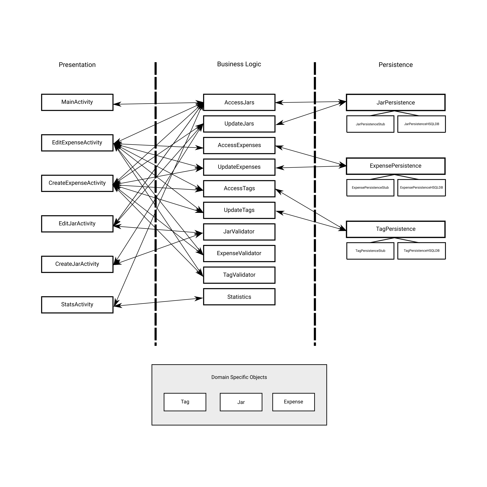

# Architecture:

Our application is designed with a 3-tier architecture. It is broken into 5 main java packages: `application`, `business logic`, `domain objects`, `persistence` and `presentation` (as shown in the diagram). 

## Presentation layer:

Our application has 5 activities: `MainActivity`, `CreateJarActivity`, `EditJarActivity`, `CreateExpenseActivity`, `EditExpenseActivity` and `StatsActivity`. 
The `MainActivity` acts as the home screen for our application, where each jar is displayed along with its expenses. This home screen acts as the central hub of our application. The `CreateJarActivity` allows the user to add new jars to the system, which includes setting the name, monthly budget, and theme of jar. The `EditJarActivity` allows the user to modify a jar’s configuration. This activity lets the user change the monthly budget of a certain jar or delete the jar all together. Deleting the jar will in turn remove all expenses associated with that jar. The `CreateExpenseActivity` allows the user to log new expenses into the system and associate an already existing jar to the expense. Each new expense will affect the associated jar’s current balance for that month. Additionally, new or existing tags can be attached to an expense. In `EditExpenseActivity` users can modify the selected expense by changing the name, date, amount, or removing the expense from the system. In the `StatsActivity` users are able to view averages, and summaries of their expenses, including an overall percentage of how much they are saving through our app.

## Persistence layer:

The persistence layer has 3 interfaces: `JarPersistence`, `ExpensePersistence`, and `TagPersistence`. 
Each of these interfaces is responsible for handling the loading, updating or removal of associated domain object types. For the first iteration, only the stub implementations were added to provide testing data for our application. In the second iteration, we added HSQLDB implemenations of these persistence interfaces, so that we could store and maintain the state of our application (the data we store) after having been closed. This implemenation makes use of 3 SQL tables, `TAGS`, `EXPENSES`, `JARS`, which are used in storing domain objects. Additionally we include 2 tables for storing the relationships between the domain objects of our application, `EXPENSETAGS` and `JARSEXPENSES`.

Additionally, we included a `Services` singleton class, which lets the user reference the persistence layer from anywhere inside the application.

## Business logic layer:

The business logic layer contains several classes: `AccessJars`, `AccessExpenses`, `AccessTags`, `updateJars`, `UpdateExpenses`, `UpdateTags` `ExpenseValidator`, `TagValidator`, `JarValidator` and `Statistics`. 
Each access layer class contains functionality for accessing a list of data from their associated domain objects, created via the persistence layer implementations. In future iterations, functionality will be added for performing specific searches on these lists, such as retrieving expenses by a given tag or search term, or accessing jars which have gone over their budget. The validator classes are utilities which assist in checking user input for its validity, ensuring correct and formatted data. The 'update' grouping of classes are used for modifying the systems data and acts as a means to communicate with the persistence layer. Through these classes we are able to update the system's stored domain objects and data from anywhere within the application. Lastly, the `Statistics` class offers helper methods for computing various averages which are of interest to the users of our app.

## Domain objects:

Three primary domain objects exist: `Jar`, `Expense`, and `Tag`. 
`Jar` represents a single, unique jar in the system. One instance of `Jar` is a list of Expenses. The `Expense` object represents a single logged expense and contains a list of tags that the expense has associated with it. The `Tag` object represents tags which can be attached to an expense. This allows the user to group expenses across multiple different jars.

